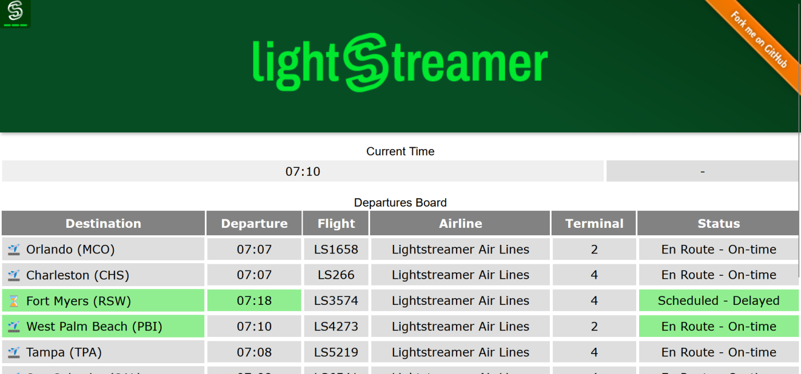

# Lightstreamer - DynamoDB Demo - Web Client

This project includes a Lightstreamer web client that subscribes to and show data from the [Lightstreamer - DynameDB Demo - Kotlin Adapter](https://github.com/Lightstreamer/Lightstreamer-example-DynamoDB-adapter-kotlin).

## Live Demo

 
### [ View live demo](http://demos.lightstreamer.com/DynamoDBDemo/)

## Details

The Demo simulates a basic departures board with a few rows which represent information on flights departing from a hypothetical airport.
The data are simulated in the back-end and retrieved from an [Amazon DynamoDB](https://aws.amazon.com/en/dynamodb/) data source.
How to retrieve this information from the DB and inject it into the Lightstreamer Server is the task of the adapter project:  [Lightstreamer - DynameDB Demo - Kotlin Adapter](https://github.com/Lightstreamer/Lightstreamer-example-DynamoDB-adapter-kotlin).

This page uses the [Web Client SDK API for Lightstreamer](https://lightstreamer.com/api/ls-web-client/latest/) to handle the communications with Lightstreamer Server. A simple user interface is implemented to display the real-time data received from Lightstreamer Server.

The demo includes the following client-side functionalities:

* A [Subscription](https://lightstreamer.com/api/ls-web-client/latest/Subscription.html) containing only 1 item and 1 field, subscribed to in **MERGE** mode, and feeding a [DynaGrid](https://lightstreamer.com/api/ls-web-client/latest/DynaGrid.html) with the simulated current time (and yes, the time in this demo is accelerated).
* A [Subscription](https://lightstreamer.com/api/ls-web-client/latest/Subscription.html) with a single item subscribed to in **COMMAND** mode feeding a [DynaGrid](https://lightstreamer.com/api/ls-web-client/latest/DynaGrid.html) with the current list and status of the next departing flights (according with the simulated time).

## Install

If you want to install a version of this demo pointing to your local Lightstreamer Server, follow these steps:

* As prerequisite, the [Lightstreamer - DynameDB Demo - Kotlin Adapter](https://github.com/Lightstreamer/Lightstreamer-example-DynamoDB-adapter-kotlin) has to be deployed on your local Lightstreamer Server instance. Please check out that project and follow the installation instructions provided in it.
* Download this project.
* Deploy this demo on the Lightstreamer Server (used as Web server) or in any external Web Server. If you choose the former, create the folders `<LS_HOME>/pages/demos/DynamoDBDemo` and copy here the contents of the `src` folder of this project.

The client demo configuration assumes that Lightstreamer Server, Lightstreamer Adapters, and this client are launched on the same machine. If you need to target a different Lightstreamer server, please double check the `LS_HOST` variable in `src/js/const.js` and change it accordingly.

* Open your browser and point it to: [http://localhost:8080/DynamoDBDemo](http://localhost:8080/DynamoDBDemo)

## See Also

* Our blog post: [Virtual Airport Demo: Connecting DynamoDB to Lightstreamer](https://blog.lightstreamer.com/2023/01/virtual-airport-demo-connecting.html)

### Lightstreamer Adapters Needed by This Client

* [Lightstreamer - DynameDB Demo - Kotlin Adapter](https://github.com/Lightstreamer/Lightstreamer-example-DynamoDB-adapter-kotlin)
* [Lightstreamer - Reusable Metadata Adapters - Java Adapter](https://github.com/Lightstreamer/Lightstreamer-example-ReusableMetadata-adapter-java)

## Lightstreamer Compatibility Notes

- Compatible with Lightstreamer JavaScript Client library version 6.0 or newer.
