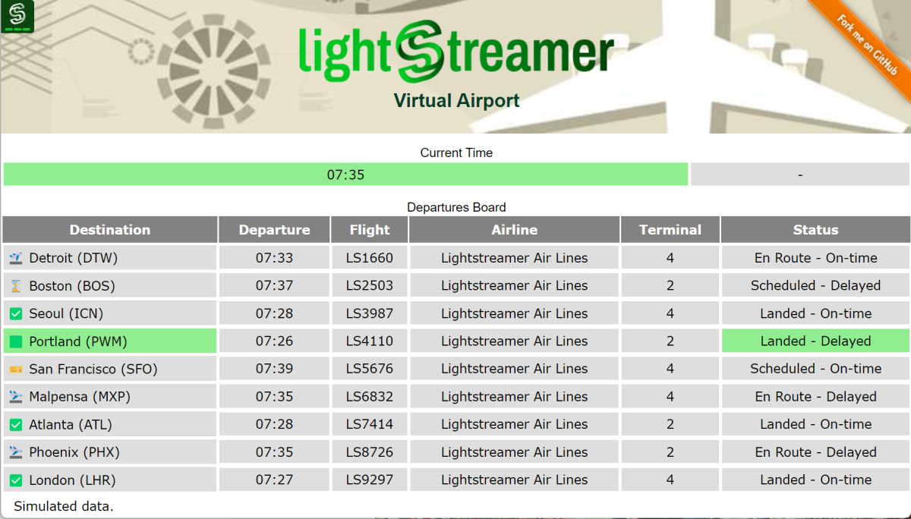

# Lightstreamer - DynamoDB Demo - Web Client

This project includes a Lightstreamer web client that subscribes to and show data from the [Lightstreamer - DynameDB Demo - Java Adapter](https://github.com/Lightstreamer/Lightstreamer-example-Stocklist-adapter-java).

## Live Demo

 
### [ View live demo](http://demos.lightstreamer.com/DynamoDBDemo/)

## Details

The Demo simulates a basic departure flight monitor with a few lines, about ten, which represent information on flights departing from a hypothetical airport.
The data are simulated in the back-end and retrieved from an [Amazon DynamoDB](https://aws.amazon.com/en/dynamodb/) data source.
How to retrieve this information from the DB and inject it into the Lightstreamer Server is the task of the adapter project:  [Lightstreamer - DynameDB Demo - Java Adapter](https://github.com/Lightstreamer/Lightstreamer-example-Stocklist-adapter-java).

This page uses the [Web Client SDK API for Lightstreamer](https://lightstreamer.com/api/ls-web-client/latest/) to handle the communications with Lightstreamer Server. A simple user interface is implemented to display the real-time data received from Lightstreamer Server.

The demo includes the following client-side functionalities:

* A [Subscription](https://lightstreamer.com/api/ls-web-client/latest/Subscription.html) containing only 1 item and 1 field, subscribed to in **MERGE** mode, and feeding a [DynaGrid](https://lightstreamer.com/api/ls-web-client/latest/DynaGrid.html) with the simulted current time (yes the time in this demo is accelerated).
* A [Subscription](https://lightstreamer.com/api/ls-web-client/latest/Subscription.html) with a single item subscribed to in **COMMAND** mode feeding a [DynaGrid](https://lightstreamer.com/api/ls-web-client/latest/DynaGrid.html) with the curent list and status of the next departing flights (according with the simulated time).

## Install

- To try this web page targeting our live push demo server, nel file const.js